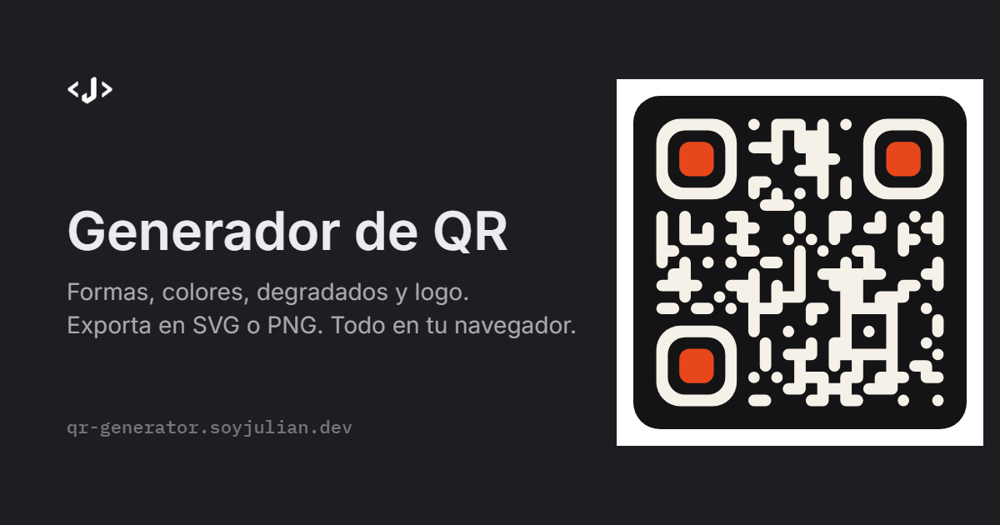

# Generador de QR

Generador de códigos QR personalizables que corre entero en el navegador. Formas de módulo, esquinas, colores sólidos o en degradado, logo centrado, exportación a SVG/PNG y **verificación de lectura en tiempo real** con un decodificador real.

**→ [qr-generator.soyjulian.dev](https://qr-generator.soyjulian.dev)**



## Qué hace

- **Contenido**: URL, texto libre, Wi-Fi (WPA/WEP/abierta, red oculta), contacto (vCard 3.0), email, SMS y teléfono.
- **Forma**: seis estilos de módulo (cuadrado, redondeado, puntos, fluido, clásico, rombo), cuatro formas de esquina y cinco de centro de esquina, tamaño de módulo ajustable.
- **Color**: relleno sólido, degradado lineal (con ángulo) o radial; color independiente para esquinas y centros; fondo de color o transparente; aviso de contraste bajo.
- **Logo**: arrastra una imagen (PNG, JPG, SVG, WebP), ajusta tamaño, margen y redondeo, vacía los módulos que quedan debajo y pon fondo detrás. Al añadir un logo la corrección de errores sube a H automáticamente.
- **Marco y corrección**: zona de silencio, esquinas redondeadas del fondo y nivel de corrección L/M/Q/H.
- **Estilos rápidos**: ocho presets, cada uno previsualizado con un QR real dibujado con ese estilo.
- **Exportación**: SVG vectorial o PNG a 512 / 1024 / 2048 / 4096 px, copiar al portapapeles y enlace compartible (la configuración viaja en la URL).
- **Verificación**: cada cambio se rasteriza y se intenta decodificar con [jsQR](https://github.com/cozmo/jsQR) a dos escalas; si el diseño no se lee, la app lo dice antes de que lo imprimas.
- Interfaz en español e inglés, tema oscuro (por defecto) y claro. Nada sale de tu equipo: no hay servidor.

## Cómo funciona el renderizado

No se usa ninguna librería de «QR con estilos». [`qrcode`](https://github.com/soldair/node-qrcode) solo se encarga de la codificación (Reed-Solomon, enmascarado, elección de versión) y devuelve la matriz de módulos; todo el dibujo está en [`src/lib/qr`](src/lib/qr):

| Archivo | Qué hace |
| --- | --- |
| `matrix.ts` | Codifica el texto y expone la matriz y los helpers de posición (finders). |
| `shapes.ts` | Generadores de path SVG para cada forma de módulo, anillo de finder y punto central. La forma «fluido» mira a los vecinos para redondear solo los extremos libres. |
| `render.ts` | Compone el SVG: fondo, módulos (un único `<path>`), finders, degradados, logo con `clipPath` y vaciado de módulos. Coordenadas en unidades de módulo, así que el mismo SVG sirve a cualquier tamaño. |
| `export.ts` | SVG → canvas → PNG, descargas, portapapeles y nombre de archivo sugerido. |
| `verify.ts` | Rasteriza y decodifica con jsQR para comprobar que el resultado se lee y coincide con el contenido. |

## Stack

- [Vite](https://vite.dev) + [React 19](https://react.dev) + TypeScript
- [Tailwind CSS 4](https://tailwindcss.com) con tokens semánticos por tema (`data-theme` en `<html>`)
- Iconos [Solar](https://www.figma.com/community/file/1166831539721848736) vía [unplugin-icons](https://github.com/unplugin/unplugin-icons) (compilados a componentes en build, sin peticiones en runtime)
- Fuentes Inter e IBM Plex Mono autoalojadas con `@fontsource`
- Tests con [Vitest](https://vitest.dev)

## Comandos

```bash
pnpm install       # dependencias
pnpm dev           # servidor de desarrollo en http://localhost:5173
pnpm build         # typecheck + build de producción en dist/
pnpm preview       # previsualizar la build
pnpm test          # tests unitarios (constructores de contenido, renderizador, estado en URL)
pnpm typecheck     # solo comprobación de tipos
```

## Estructura

```
src/
├── components/
│   ├── controls/       Field, Segmented, Slider, Toggle, ColorField, ShapePicker
│   ├── panels/         PresetsRow, ContentPanel, ShapePanel, ColorPanel, LogoPanel, FramePanel
│   ├── Preview.tsx     Tarjeta del QR, estado de lectura, ficha técnica y exportación
│   ├── Header.tsx / Footer.tsx / Section.tsx
│   └── shape-previews.tsx   Miniaturas de forma dibujadas con el propio motor
├── hooks/              useQr (codificar + renderizar), useVerify, useFlash
├── lib/
│   ├── qr/             Motor de renderizado (ver arriba)
│   ├── content.ts      Constructores de payload (WIFI:, vCard, mailto:, SMSTO:, tel:)
│   ├── presets.ts      Estilo por defecto, presets y paleta
│   ├── url-state.ts    Estado compartible en el hash de la URL
│   ├── i18n.tsx        Diccionario ES/EN y proveedor
│   ├── theme.ts        Tema claro/oscuro persistido en localStorage
│   └── sample-logos.ts Logos de ejemplo
└── styles/global.css   Tokens de tema, utilidades y controles nativos restilizados
```

## Despliegue

Es un sitio estático. En [Vercel](https://vercel.com) basta con importar el repositorio: detecta Vite, ejecuta `pnpm build` y publica `dist/`. El [`vercel.json`](vercel.json) añade caché inmutable para `/assets` y cabeceras de seguridad. Para el dominio, añade `qr-generator.soyjulian.dev` en el proyecto y crea el CNAME correspondiente en el DNS de `soyjulian.dev`.

## Licencia

[MIT](LICENSE) · Hecho por [Julián Montañez Martos](https://soyjulian.dev)
